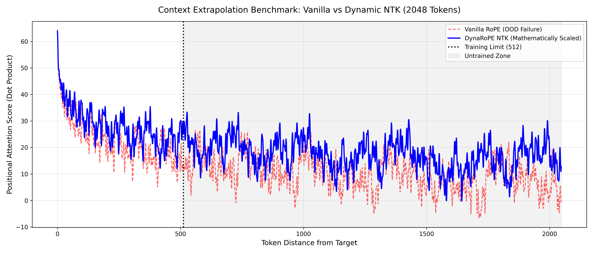

# DynaRoPE-NTK: Dynamic Context Extrapolation Engine

🚀 **A production-ready PyTorch module extending LLM context windows using Dynamic Neural Tangent Kernel (NTK) scaling.**

## TL;DR: What This Does
* **Extends Context Zero-Shot:** Takes a model trained on a strict token limit (e.g., 512) and safely forces it to understand massive sequences (e.g., 2048+) at inference time.
* **Preserves Grammar:** Protects high-frequency local attention (adjacent words) from being corrupted.
* **No Retraining:** Achieves architectural stability without requiring expensive fine-tuning passes.


## The Technical Problem: Out-of-Distribution (OOD) Collapse

Vanilla Rotary Positional Embeddings (RoPE) map sequence positions to rotations in the complex plane. 

### The Vanilla Math
Every token vector is split into 2D pairs, and each pair ($i$) is rotated by an angle based on its absolute position ($m$) and a decaying base frequency ($f_i$):

$$f_i = \theta^{-\frac{2i}{d}}$$

*(Where $d$ is the embedding dimension and $\theta$ is the base, standardly 10,000).*

### The "Crash"
The math works flawlessly at any distance, but the **neural network weights do not**. 
* If a model is trained on 512 tokens, the attention layers only know how to interpret wave patterns generated inside that 0-512 zone. 
* When you pass 2048 tokens, the wave continues into an "Untrained Zone." The attention softmax function receives highly chaotic, negative dot products it has never seen before. 
* The attention matrix completely shatters into entropy, resulting in the classic LLM hallucination loop.


## The SOTA Fix: Dynamic NTK Interpolation

Early attempts to fix this used **Linear Interpolation**, which simply divided all positions by the scale factor. This acted like a sledgehammer—it crushed the distance between immediate words (e.g., Token 1 and Token 2 became Token 0.25 and 0.50), completely destroying the model's local grammar.

**DynaRoPE uses NTK Scaling**, which acts as a smart equalizer. Instead of dividing positions, it manipulates the base frequency ($\theta$) using a non-linear exponent.

### The NTK Formula

$$\theta' = \theta \cdot \left(\frac{L'}{L}\right)^{\frac{d}{d-2}}$$

*(Where $L'$ is your target length and $L$ is your training limit).*

### Why The Math Works
By recalculating $\theta$ dynamically based on the target length, the engine applies selective compression across the vector dimensions:
* **The Treble (Dimension $i=0$):** High-frequency pairs are mathematically shielded. The rotation speed barely changes. Immediate grammatical relationships ($1$ space apart) remain perfectly intact.
* **The Bass (Dimension $i=d/2$):** Low-frequency pairs are heavily compressed. Their rotational wavelengths are stretched out, safely packing the global geometry of 2048 tokens into the 512-token receptive field the model already understands.

---

## Empirical Proof: The Matrix Visualized

To prove the architecture works, we isolate the mathematical "heartbeat" of the model. We plot the raw attention dot product ($Q \times K^T$) of Token 0 against every other token in a 2048-token sequence.



### How to Read the Results:
* **The Safe Zone (0 to 512):** The area to the left of the dotted line represents the distances the model was trained on. Notice how the Blue (NTK) line perfectly hugs the Red (Vanilla) line. This proves our engine protects local grammar and immediate context. 

* **Vanilla Failure (Red Dashed Line):** Once the sequence crosses the 512-token training limit, the Vanilla wave collapses. It drops into severe negative values and oscillates erratically. The neural network's Softmax function has never been trained to decode these chaotic, negative numbers, causing the model to hallucinate.

* **DynaRoPE Success (Solid blue line):** Notice how the Blue line stays lifted and stable past 512. Instead of crashing, its wavelength is noticeably stretched out. By dynamically scaling the base frequency ($\theta$), DynaRoPE mathematically compressed the geometry of 2048 tokens so that it perfectly mimics the stable wave patterns found inside the 512-token Safe Zone

---

## 🛠️ Installation

Designed for MLOps and clean namespaces, install directly via `pip`.

```bash
git clone [https://github.com/RamuNalla/dynarope-ntk.git](https://github.com/RamuNalla/dynarope-ntk.git)
cd dynarope-ntk
pip install -e .
```

---

## 💻 Quickstart (Drop-in Replacement)

DynaRoPE acts as a seamless architectural upgrade. Simply replace your standard Causal Self-Attention block. The NTK math automatically triggers *only* when the input exceeds your specified `max_train_len`.

```python
import torch
from dynarope import RoPEAttention

# Initialize layer trained for 512 tokens
attention = RoPEAttention(d_model=256, n_heads=8, max_train_len=512)

# Pass a sequence 4x the training length (2048 tokens)
# The NTK engine intercepts the geometry and scales the base frequencies to prevent collapse
long_sequence = torch.randn(1, 2048, 256)
output = attention(long_sequence)

print(output.shape) # (1, 2048, 256)
```
---

## 🧪 Benchmark & Evaluation Suite

This repository ships with a full evaluation suite to programmatically verify tensor shapes, mathematical invariants, and to generate the attention heatmaps shown above.

```python
# Run mathematical invariants and CI/CD shape tests
pytest tests/

# Generate the 1D Context Extrapolation
python scripts/run_needle_test.py

# Generate the 2D Attention Softmax Heatmaps
python scripts/run_heatmap_benchmark.py
```

---

## 🧠 Architecture Highlights
* **Hardware Accelerated:** Natively intercepts tensors prior to `F.scaled_dot_product_attention`, ensuring zero-friction compatibility with FlashAttention GPU kernels.
* **Dimension Agnostic:** The complex-plane rotation (`torch.polar`) dynamically maps to any even-numbered attention head dimension.
* **Zero-Gradient Overhead:** Frequencies are precomputed and cached during the forward pass, avoiding unnecessary autograd tracking.